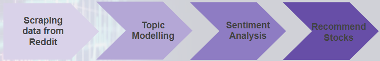
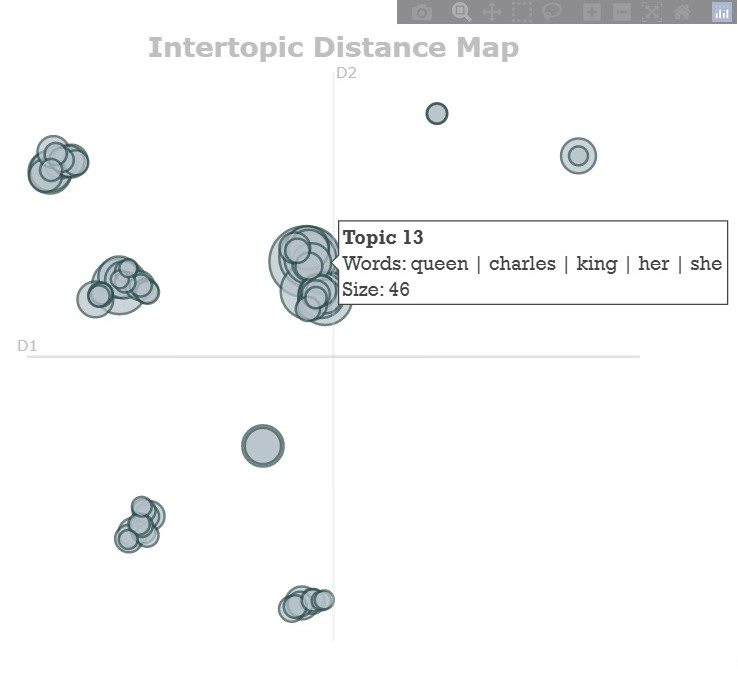

# Topic Modeling

	A topic model is a type of statistical model for discovering abstract "topics" that occur in a collection of documents
	Useful to get a general summary of topics being discussed in the data
	Advanced topic models like BERTopic also provide association between these topics

# Project Motivation

I was familiar with traditional topic modeling techniques like Latent Dirichlet Allocation (LDA), but I wanted to explore BERTopic which is more sophisticated and recent algorithm in topic modeling. It overcomes certain drawbacks of LDA like pre-processing requirements, unstable results and high processing power by leveraging techniques like UMAP, c-TF-IDF and word embeddings.

# Problem Statement

With the emergence of meme stocks and several online forums for stock trading, it has become necessary for financial institutions to factor in market sentiments from such sources while making investment decisions. Case in point - [GameStop short squeeze](https://en.wikipedia.org/wiki/GameStop_short_squeeze) causing major financial consequences for certain hedge funds and large losses for short sellers.

Wallstreetbets on Reddit is one of the many public forums where people discuss such recent market trends and express their sentiments about them.
This project focuses on WallStreetBets (responsible for the GME short-squeeze linked above) to identify popular topics and stocks being discussed in the comments and posts, and recommend stocks to buy based on that analysis.

# Installation

* BERTopic
* praw (Python Reddit API Wrapper)
* pmaw (Pushshift Multithread API Wrapper)
* sklearn
* joblib==1.1.0 (needed because of conflicts with BERTopic)

# Data Source

### For Topic Modelling
	Scraped ~500k comments & posts from the subreddit r/Wallstreetbets
	Date range: Sept 1, 2022 to Sept 30, 2022
### For Sentiment Analysis
	Scrape data to get top stock tickers from Sept 1, 2022 to Sept 30, 2022
	Scrape data for only those top tickers to perform sentiment analysis
### Stock Simulator - Retrospect
	Scraped Yahoo finance for actual monthly closing prices 

# Approach

### For Topic Modelling
	Remove comments with less than 10 words to ensure only opinions are well-explained
	Only keep content with more than 5 upvotes to weed out irrelevant content
	Remove outlier topics (taken care by BERT)
### For Sentiment Analysis
	Modify VADER's sentiment score on lexicons we got from topic modelling
	+2 for positive sentiment & -10 for negative sentiment
### Stock Simulator - Retrospect
	Perform sentiment analysis on top 10 tickers in windows of 90, 60 and 30 days, and 
	Get actual data from yahoo finance for the same top 10 tickers to compare our recommendations

# Novel insight

Queen of England's death is associated closely with topics related to inflation (center cluster of topic).

# Future scope

	Use an embedding-based sentiment analyzer (e.g., "Flair"), instead of heuristic-based technique like VADER. We stopped at VADER since it was giving good results (8 out of 10 recommended stocks were in profit)
	Create a multi-processing scraper using joblib for faster scraping
